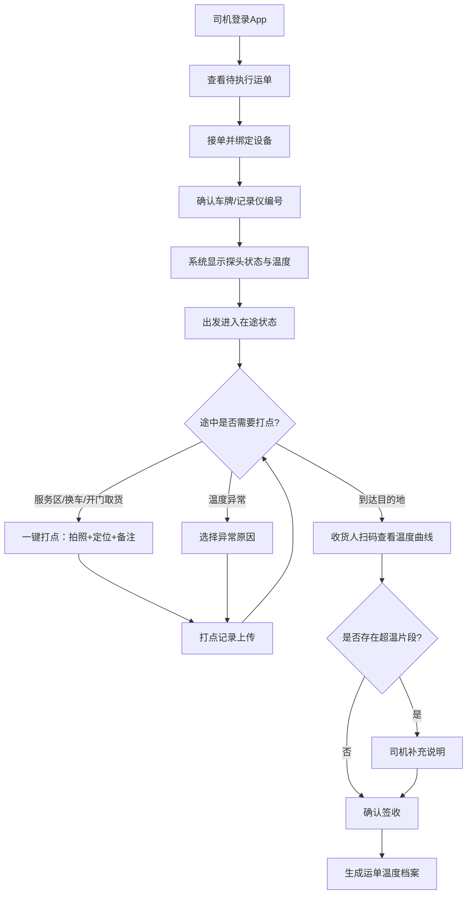

## 1. 产品概述

冷链司机移动 App，面向承运司机在装车、在途、卸货三个节点完成温度留痕，解决冷链运输过程中温度监控不连续、异常难追溯、交接信息不对称的问题。目标用户为冷链物流承运司机与收货方，产品价值在于形成可追责的运单温度档案，降低货损纠纷风险。

## 2. 核心功能

### 2.1 用户角色

| 角色 | 注册方式 | 核心权限 |
|------|----------|----------|
| 承运司机 | 手机号注册 | 接单、设备绑定、温度打点、异常上报、运单交接 |
| 收货人 | 扫码访问（无需注册） | 查看温度曲线、确认签收、查看关键节点记录 |

### 2.2 功能模块

1. **运单列表页**：运单状态筛选、待执行运单接单、设备绑定确认、探头在线状态与最近温度提示
2. **温度详情页**：实时温度曲线展示、途中温度打点（照片+定位+备注）、异常原因快捷选择、历史打点记录时间轴
3. **交接签收页**：全程温度曲线与关键节点、扫码签收确认、超温片段补充说明、签收完成生成温度档案

### 2.3 页面详情

| 页面名称 | 模块名称 | 功能描述 |
|----------|----------|----------|
| 运单列表页 | 状态筛选栏 | 按待执行/在途/已完成筛选运单，顶部Tab切换 |
| 运单列表页 | 运单卡片 | 显示运单号、起止地、货物类型、当前状态、温度状态指示灯 |
| 运单列表页 | 设备绑定弹窗 | 输入车牌号或温度记录仪编号确认设备，显示探头在线状态和最近温度 |
| 温度详情页 | 温度曲线区 | 实时绘制温度折线图，标注异常区间、正常范围色带 |
| 温度详情页 | 打点操作栏 | 一键打点按钮（拍照/定位/备注），异常原因快捷选择（短时开门/设备移位/车厢预冷不足） |
| 温度详情页 | 打点时间轴 | 按时间倒序展示打点记录，含缩略图、地址、备注、异常标签 |
| 交接签收页 | 温度全程回顾 | 展示完整温度曲线，标注装车/在途/卸货三个阶段，高亮超温片段 |
| 交接签收页 | 关键节点记录 | 装车确认、异常打点、到货确认等关键节点卡片列表 |
| 交接签收页 | 签收操作区 | 收货人扫码后显示确认按钮，超温时弹出补充说明输入框，签收后生成温度档案 |

## 3. 核心流程

司机打开App查看待执行运单 → 接单并绑定设备（确认车牌/温度记录仪编号） → 系统显示探头在线状态与最近温度 → 司机出发进入在途状态 → 途中需要时可一键打点（拍照+定位+备注） → 遇到异常选择原因 → 到达目的地 → 收货人扫码查看全程温度曲线 → 确认无误后签收（若有超温需司机补充说明） → 生成可追责运单温度档案

## 4. 用户界面设计

### 4.1 设计风格

- 主色调：冰蓝 #0EA5E9（冷链主题），辅色：深灰 #1E293B（沉稳专业）、警告橙 #F97316（异常提示）
- 按钮风格：圆角大按钮（适合司机戴手套操作），主按钮填充式，次要按钮描边式
- 字体：标题 18px 加粗，正文 15px 常规，辅助 13px，使用系统字体保证可读性
- 布局风格：底部Tab导航，卡片式列表，移动端优先的竖屏设计
- 图标风格：线性图标，2px描边，清晰易辨识

### 4.2 页面设计概览

| 页面名称 | 模块名称 | UI元素 |
|----------|----------|--------|
| 运单列表页 | 状态筛选栏 | 顶部固定Tab，冰蓝底色选中态，圆角胶囊样式 |
| 运单列表页 | 运单卡片 | 白色圆角卡片，左侧温度状态圆点（绿/黄/红），右侧箭头指示 |
| 运单列表页 | 设备绑定弹窗 | 底部抽屉式弹出，大输入框+扫描按钮，探头状态用色块高亮 |
| 温度详情页 | 温度曲线区 | 顶部大面积折线图，浅蓝正常范围色带，红色超温区间标记 |
| 温度详情页 | 打点操作栏 | 底部悬浮大圆按钮（+号），点击展开拍照/备注/异常选择 |
| 温度详情页 | 打点时间轴 | 左侧竖线+圆点，右侧卡片含缩略图和文字信息 |
| 交接签收页 | 温度全程回顾 | 横向可滚动大图，三阶段色块分区标注 |
| 交接签收页 | 关键节点记录 | 紧凑卡片列表，图标+文字+时间戳 |
| 交接签收页 | 签收操作区 | 底部固定大按钮，绿色"确认签收"，超温时变为橙色"补充说明并签收" |

### 4.3 响应式设计

- 移动端优先设计，竖屏 375px-428px 宽度为基准
- 触控目标最小 44px，按钮间距 ≥ 12px，适合戴手套操作
- 横屏时曲线图自动展宽，列表变双列卡片
- 字体和间距在小屏上适度缩小但保持可读性

### 4.4 3D场景指导

不适用
