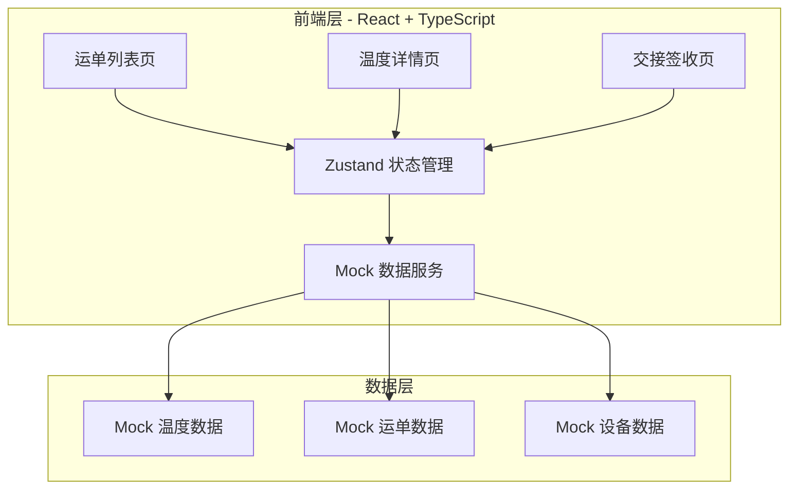
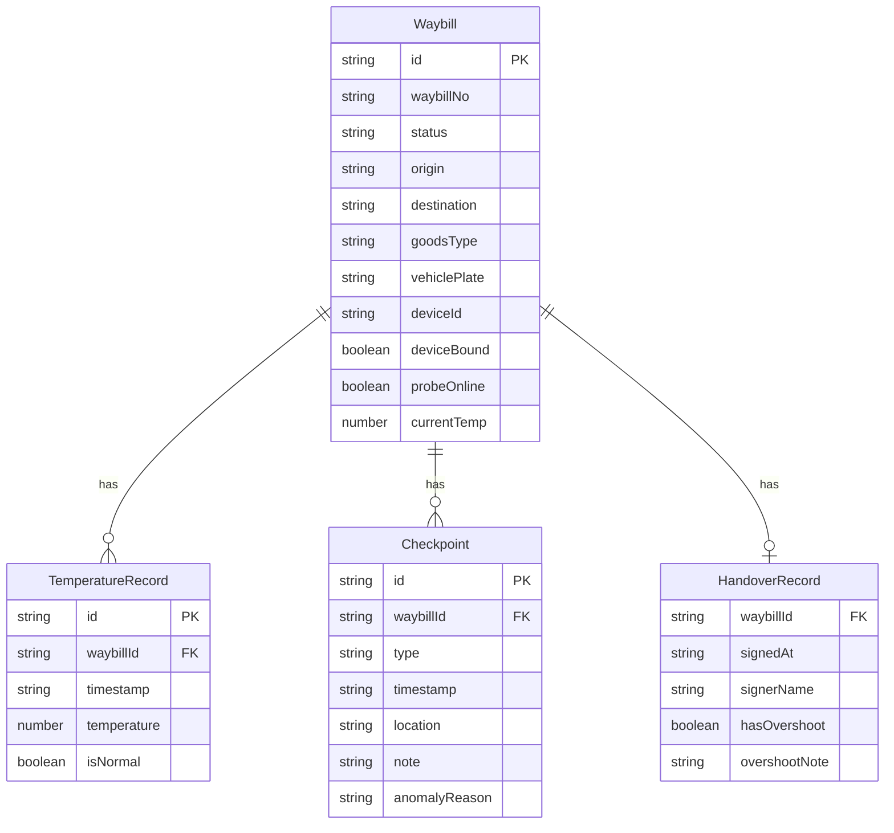

## 1. 架构设计



## 2. 技术说明

- 前端：React@18 + TypeScript + Tailwind CSS@3 + Vite
- 初始化工具：vite-init
- 后端：无（纯前端项目，使用 Mock 数据模拟）
- 数据库：无（使用内存 Mock 数据）

## 3. 路由定义

| 路由 | 用途 |
|------|------|
| / | 运单列表页，显示所有运单，支持状态筛选 |
| /waybill/:id | 温度详情页，显示运单温度曲线和打点操作 |
| /waybill/:id/handover | 交接签收页，显示全程温度回顾和签收操作 |

## 4. API 定义

无后端 API，使用 Mock 数据服务。核心数据类型定义：

```typescript
interface Waybill {
  id: string
  waybillNo: string
  status: 'pending' | 'in_transit' | 'completed'
  origin: string
  destination: string
  goodsType: string
  vehiclePlate: string
  deviceId: string
  deviceBound: boolean
  probeOnline: boolean
  currentTemp: number
  tempRange: { min: number; max: number }
  createdAt: string
  updatedAt: string
}

interface TemperatureRecord {
  id: string
  waybillId: string
  timestamp: string
  temperature: number
  isNormal: boolean
}

interface Checkpoint {
  id: string
  waybillId: string
  type: 'photo' | 'note' | 'anomaly' | 'departure' | 'arrival'
  timestamp: string
  location: string
  photo?: string
  note?: string
  anomalyReason?: 'door_open' | 'device_shift' | 'insufficient_precool'
}

interface HandoverRecord {
  waybillId: string
  signedAt: string
  signerName: string
  hasOvershoot: boolean
  overshootNote?: string
}
```

## 5. 服务端架构图

不适用（纯前端项目）

## 6. 数据模型

### 6.1 数据模型定义



### 6.2 数据定义语言

使用 TypeScript Mock 数据，无需 DDL。
